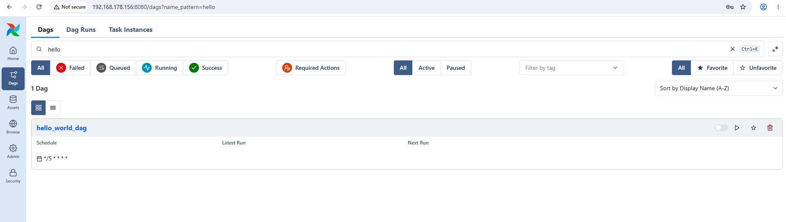
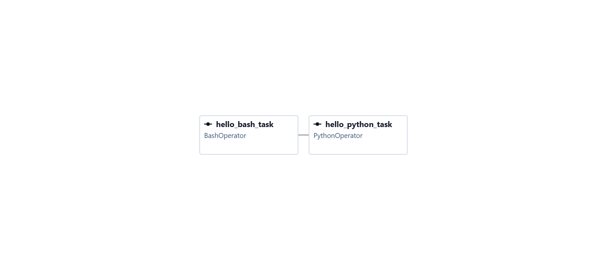
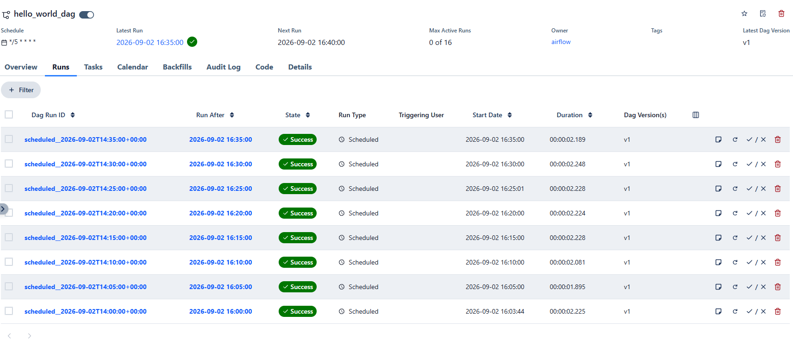
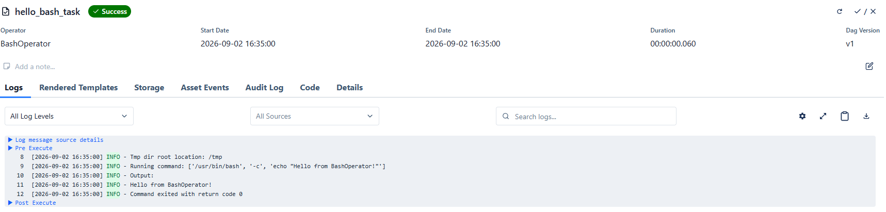
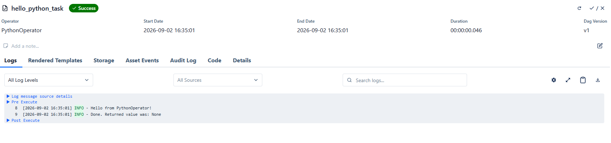

# Hello World DAG Test Report

The `hello_world_dag` is a minimal DAG used to validate the Airflow environment and confirm that basic task execution, logging, and UI visibility are functioning correctly.

This document presents the results of the tests performed on this DAG.

Given the simplicity of the code, only a subset of test categories has been applied.

Below are the screenshots collected during the variuos tests.
Comments are included only where necessary.

---

## 1. OS testing

No tests performed.

---

## 2. Container Testing

No tests performed.

---

## 3. Observability Testing

## 3.1 DAG Exists in UI

## 3.2 DAG Graph View

## 3.3 DAG Runs

The highlighted run is detailed in the component tasks shown in the sub‑sections below.

## 3.3.1 Hello World Bash Task

## 3.3.2 Hello World Python Task

## 4 Conclusions

All tests confirm that the DAG executes correctly and that the Airflow environment handles scheduling, logging, and notifications as expected.