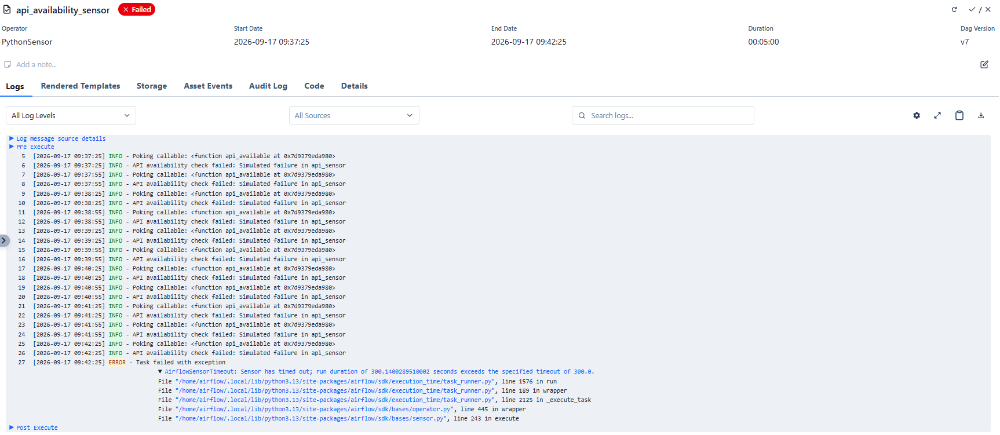
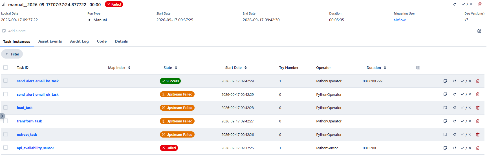
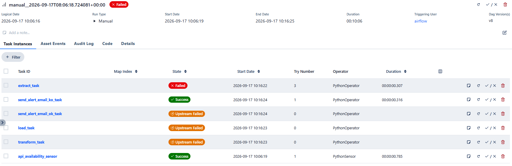
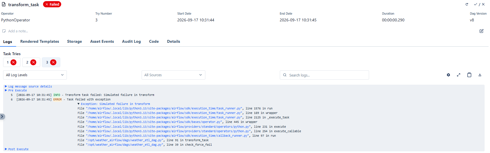
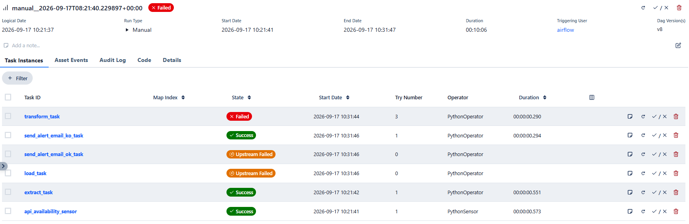
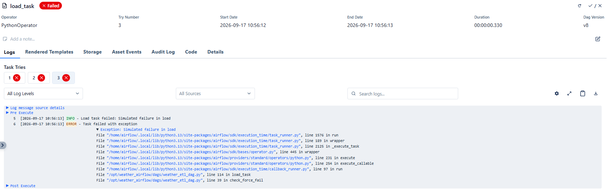
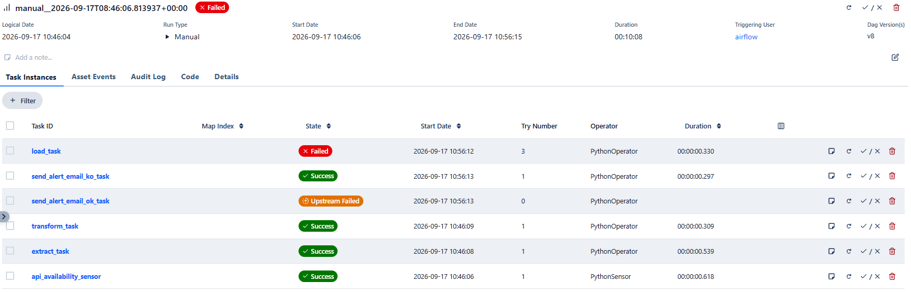

## Weather ETL DAG — Tasks Failure Scenarios

This document describes how the Weather ETL DAG behaves when one of its core tasks fails.

Failure scenarios were simulated by using the following Airflow variables, normally all set to `false`:

```json
"forced_api_sensor_failure" : "false",
"forced_extract_failure" : "false",
"forced_transform_failure" : "false",
"forced_load_failure" : "false",
```

---

## 1 What happens if sensor fails

These are the default sensor settings:

```json
poke_interval=30,
timeout=300
```

Therefore, we expect this task to fail after 10 attempts within a total timeout of 5 minutes (300 seconds).

After setting `forced_api_sensor_failure` to `true`, the task behaves as follows:



This failure stops the entire pipeline and correctly triggers the KO notification email:



## 2 What happens if extract fails

In this scenario, we set `forced_extract_failure` to `true`, producing the following task log:


The retry delays and retry count follow the global DAG settings shown below:

```json
"retries": 2,
"retry_delay": timedelta(minutes=5),
"retry_exponential_backoff": False
```

The same retry and delay values apply to the remaining tasks described in the following sections.

The corresponding pipeline status is shown below:



As shown in the screenshot, `extract` is FAILED, `transform` and `load` are SKIPPED, and the KO email is sent because the KO task uses `trigger_rule="one_failed"`.

## 3 What happens if transform fails

Using the same approach, we set `forced_transform_failure` to `true`, resulting in the following task log:



The pipeline behaves as shown below:



In this case, `extract` is SUCCESS, `transform` is FAILED, `load` is SKIPPED, and the KO email is sent as expected.

## 4 What happens if load fails

To simulate this failure, we set only `forced_load_failure` to `true`, producing the following log:



The resulting pipeline status is shown below:



In this scenario, both `extract` and `transform` are SUCCESS, `load` is FAILED, and the KO email is triggered correctly.

---

## 5. Summary

Across all scenarios, the KO alert behaves consistently: **any upstream failure triggers the KO email**.  

This is the intended behavior of `trigger_rule="one_failed"` and confirms that the notification system is robust across all failure modes.
