# Weather ETL DAG Test Report

The `weather_etl_dag` is a fully operational ETL workflow designed to extract weather data from an external API, transform it into a structured format, and load it into a DuckDB database for downstream analysis and dashboard visualization.

This DAG serves as the core functional pipeline of the project, validating not only Airflow’s scheduling and task‑execution capabilities but also the correctness of the ETL logic, branching behavior, data persistence, and email‑based notifications.

This document presents the results of the tests performed on this DAG.
Given the complexity of the workflow, all three testing layers — OS testing, container testing, and observability testing — have been applied.

Below are the screenshots collected during the various tests.
Comments are included only where necessary.

---

## 1. OS testing

### 1.1 ETL Modules

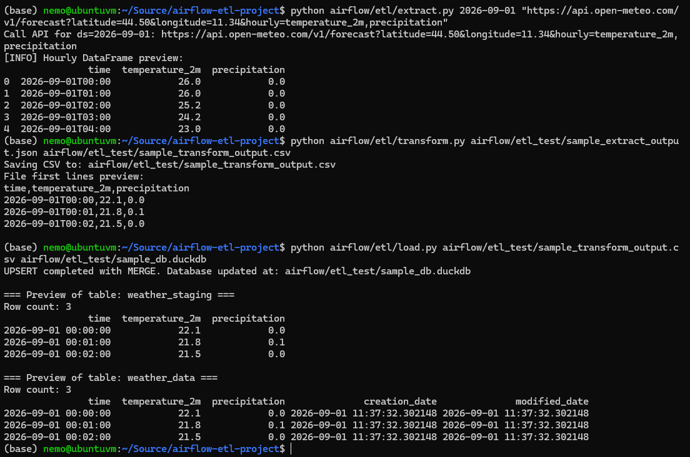

### 1.2 Email Modules

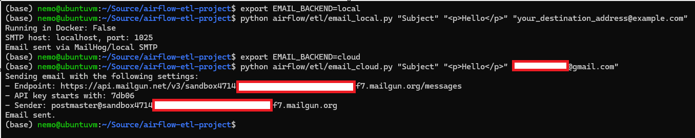

### 1.3 All Unit Tests

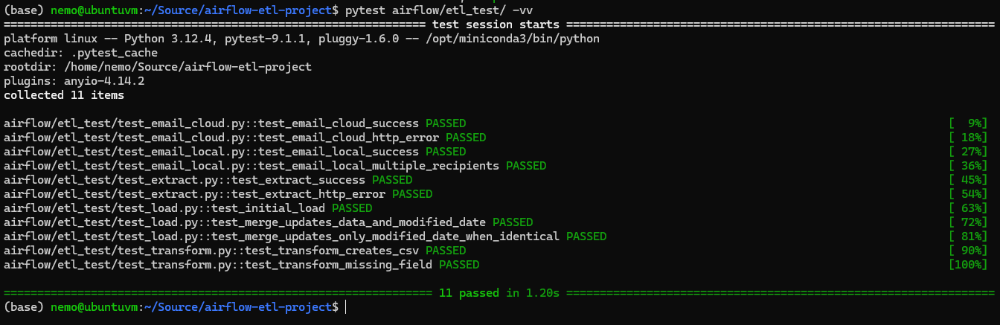

Module tests were executed using Python with real (local) inputs and outputs, without mocks.  
Unit tests validate key functional contracts and rely on synthetic data and mocked methods.

---

## 2. Container Testing

### 2.1 ETL Modules

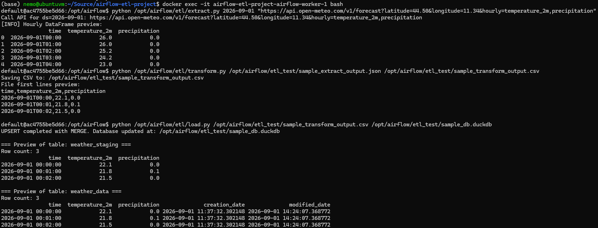

### 2.2 Email Modules

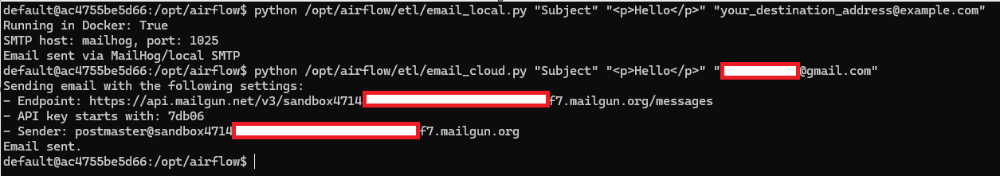

### 2.3 DAG Verification

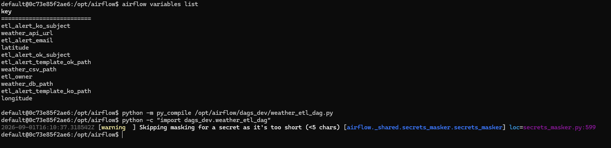

---

## 3. Observability Testing

Before examining the observability screenshots, it is important to clarify how timestamps should be interpreted.

Airflow displays all execution times in UTC, while the underlying server is configured with the Europe/Rome timezone (CEST, UTC+2 at the time of testing).

This means that Airflow’s timestamps appear two hours behind local Italian time.

All comments and interpretations in the following subsections refer to local server time unless explicitly stated otherwise.

Another important note: the ETL does not preserve historical snapshots.  

Each run updates all records within the fixed 192‑hour API window and inserts only the new future records that enter the window.  

As a result, the database always contains a single moving 192‑hour window, and each `time` value is unique.  

Therefore, `time` can safely serve as the primary key.

## 3.1 DAG Exists in UI

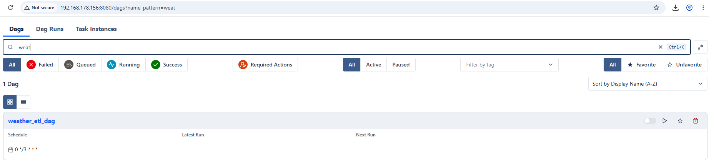

## 3.2 DAG Graph View

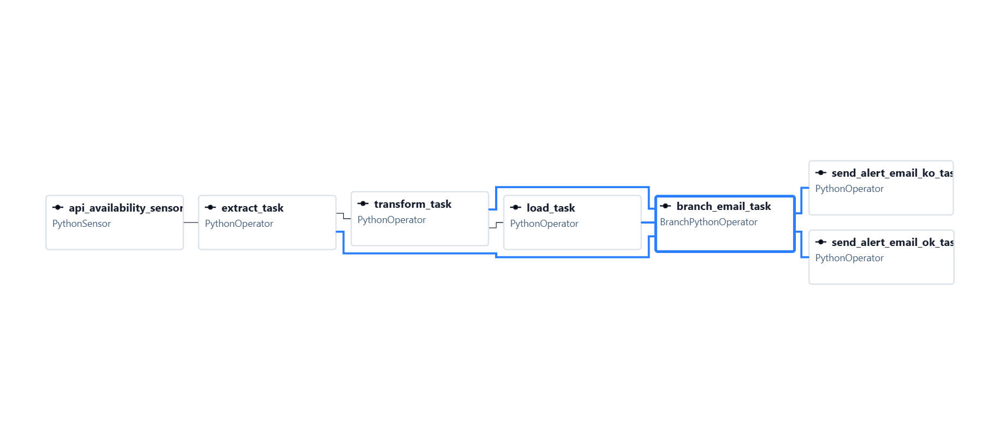

## 3.3 DAG Runs

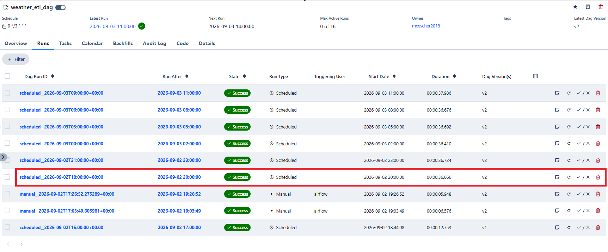

For the chosen example, this is the tasks results summary:

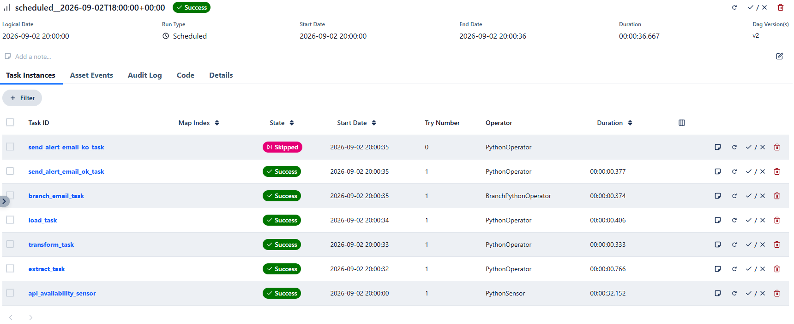

The `send_alert_email_ko_task` is skipped because all upstream tasks completed successfully.

The detailed log of each task is shown in the subsections below.

### 3.3.1 Api Sensor

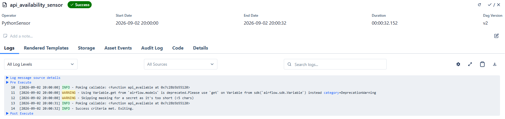

### 3.3.2 Extract

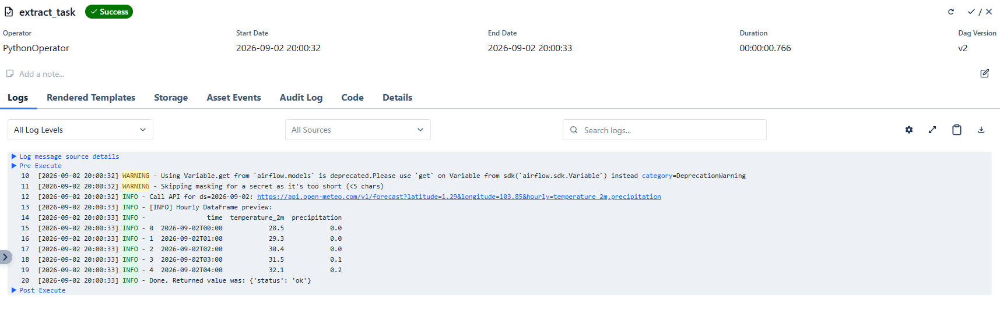

### 3.3.3 Transform

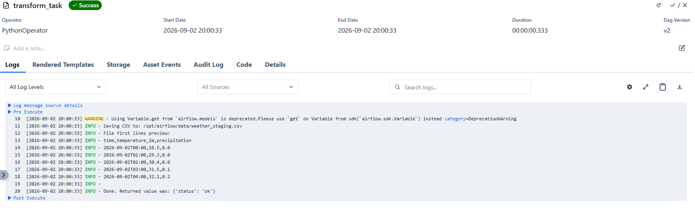

### 3.3.4 Load

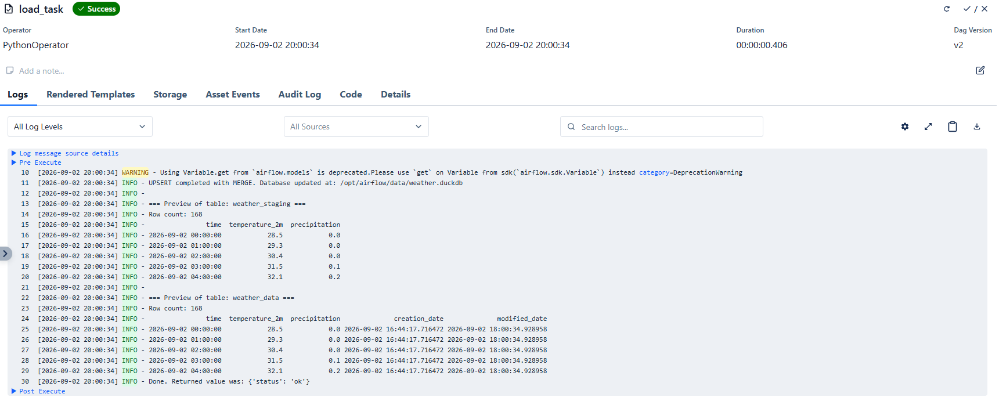

### 3.3.5 Branch

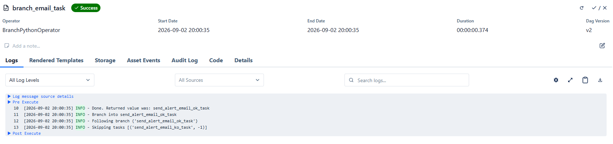

### 3.3.6 Send Email

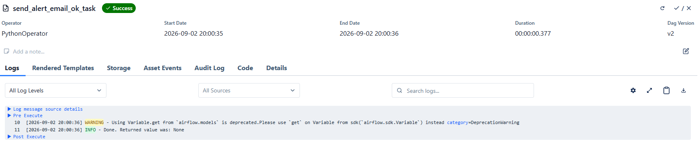

In this run the local email sender was used, allowing the mail preview to be displayed in the MailHog web UI:

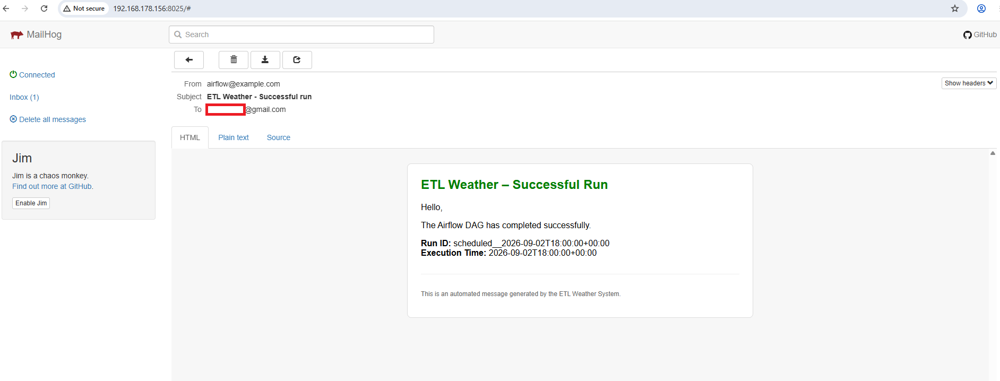

## 3.4 (Streamlit) Data Online View

The API always returns 24 hourly records for the current day plus a 7‑day hourly forecast.  
Past hours of the current day are included, so each ETL run processes a fixed 192‑hour window.

### 3.4.1 Online Data Part 1

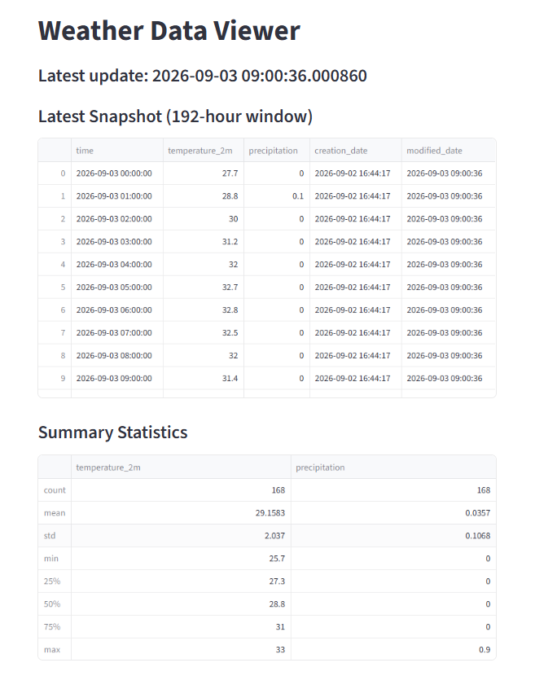

### 3.4.2 Online Data Part 2

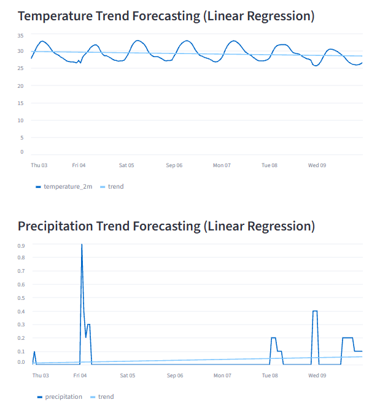

## 3.5 CSV Direct Inspection

### 3.5.1 CSV Last Update

This report was written on 03/09/2026 at 11:30 (Italian time).  

The latest update of the data files is 11:00, as expected, based on the scheduling configuration (runs every 3 hours starting at 00:00 server time, displayed in UTC in the Airflow UI).

### 3.5.2 CSV Content

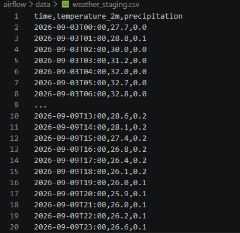

The CSV contains data from 03/09/2026 at 00:00 through 09/09/2026 at 23:00, representing the full 7‑day hourly forecast window returned by the API.

## 3.6 SQL Direct Inspection

### 3.6.1 Records Created Today

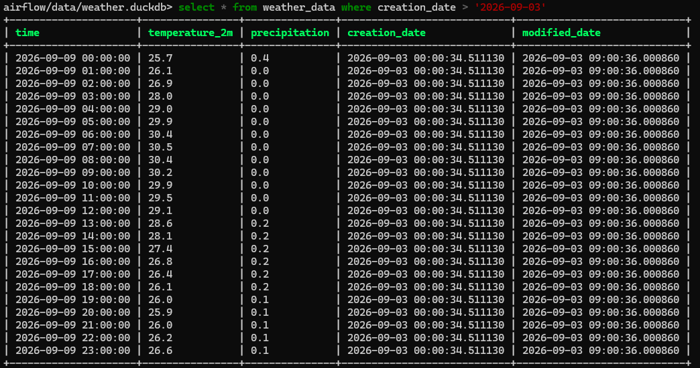

Records for 02/09/2026 were updated during the last run of that day (23:00 Italian time, 21:00 server time, displayed as UTC in Airflow).  

Records for 03/09/2026 follow the same pattern, with the latest modification at 09:00 (Italian time).

### 3.6.2 Records Newly Created

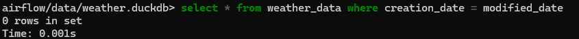

The absence of records where `creation_date = modified_date` is expected.  

The initial load sets both timestamps, but all subsequent ETL runs update the data and therefore modify the `modified_date` field.

### 3.6.3 Select All

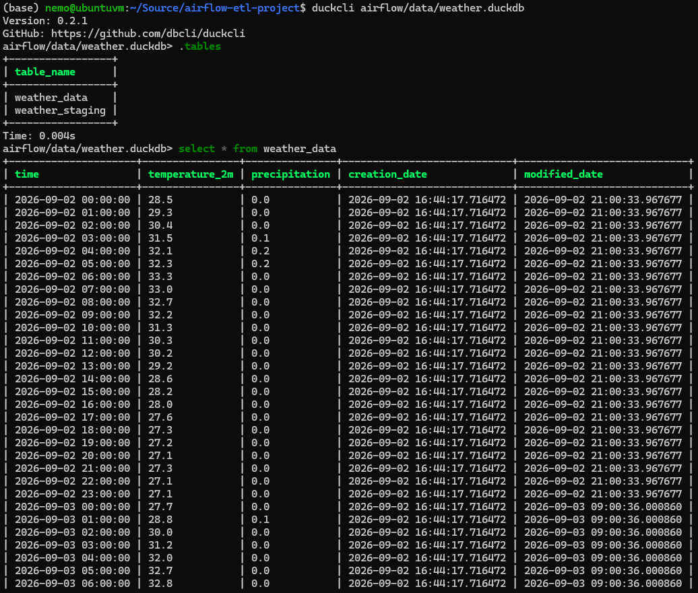

## 3.7 (Streamlit) Data Dashboard

### 3.7.1

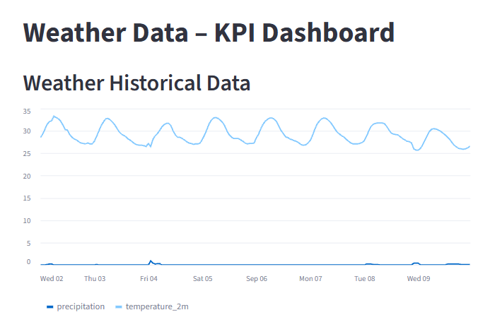

### 3.7.2

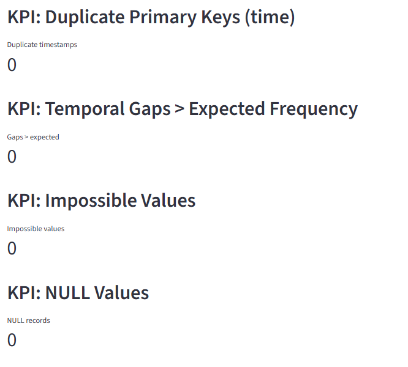

No anomalies detected:

* `time` is the primary key, as the ETL maintains a single moving 192‑hour window and updates existing timestamps rather than preserving historical snapshots.  
* Impossible values are defined as `temperature_2m` outside the interval (‑80, +80) or `precipitation` outside (0, 500), since extreme precipitation events can reach values around 100 mm/h.

### 3.7.3

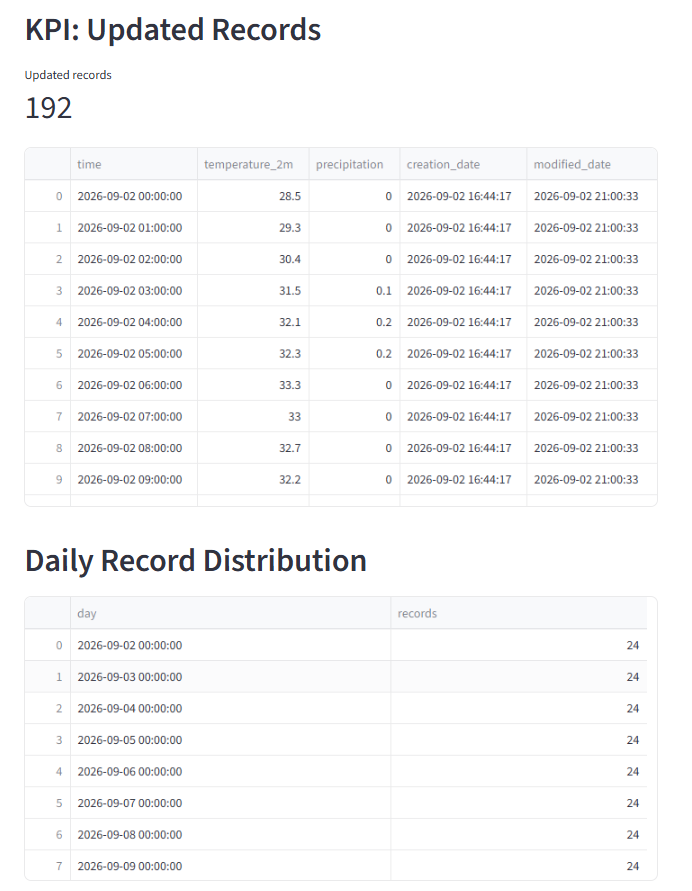

Updated records are those where `modified_date > creation_date`, and there are 192 of them, as expected.

They include:
* Yesterday’s values, inserted earlier and updated during the last daily run (23:00 Italian time, 21:00 server time), totaling 168 records.  
* Today’s values (24 records), created during the first daily run (02:00 Italian time, 00:00 server time) and updated by subsequent runs.

There are 24 records created today because the rolling window advances from the previous day to the current one, introducing a new day (09/09/2026) with hourly detail.

## 4 Conclusions

All observability checks confirm that the ETL pipeline runs reliably, updates data consistently within the 192‑hour window, and that the Airflow environment is correctly configured for scheduling, branching, logging, and notifications.